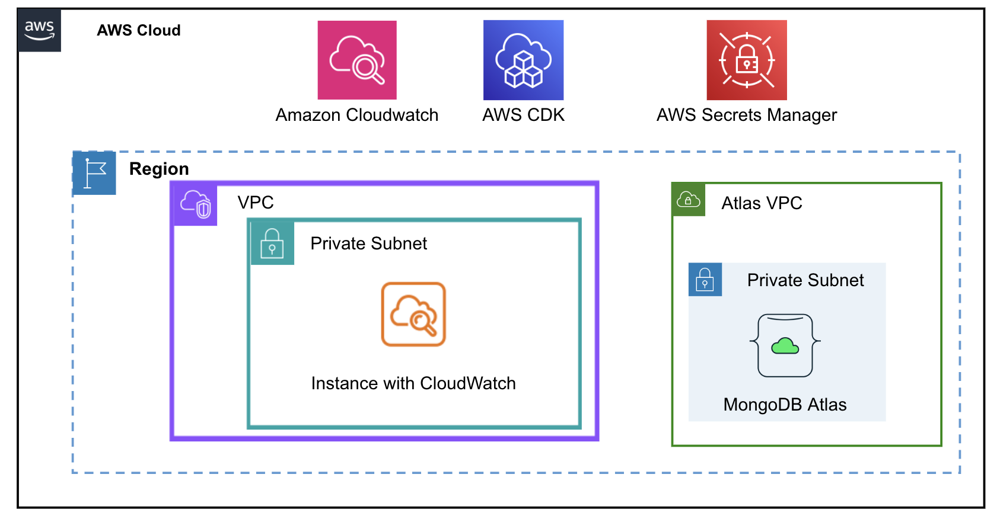

# AWS Landing Zone with MongoDB Atlas 

## Introduction

AWS Landing Zone is a solution that helps enterprises quickly set up a secure, multi-account AWS environment based on best practices. With AWS Landing Zone, enterprises can easily manage multiple AWS accounts, enforce security and compliance policies, and streamline resource provisioning. By leveraging AWS Landing Zone, enterprises can accelerate their cloud adoption journey and ensure a consistent and secure infrastructure across their organization.

This repository enables developers to setup a standard AWS Landing Zone with MongoDB Atlas.

## Usage

Developers can use this repository as a starting point for CDK development with TypeScript. It provides a blank project with the necessary setup to create an AWS Landing Zone with a VPC, Subnet, Routes , Security Group , CloudWatch and integrate it with MongoDB Atlas.

## Features

- CDK development with TypeScript
- Standard AWS Landing Zone setup
- Integration with MongoDB Atlas

## Prerequisite

- MongoDB Organization access
- AWS Account
- AWS CDK

## Solution Architecture



## Deployment Steps

### Step 1 : Set up the MongoDB Atlas Organization API access

Login to the MongoDB Atlas
Create a Organization Access through API

### Step 2: Git clone

Git clone the repository

` git clone https://github.com/mongodb-partners/AWS_LandingZone_with_MongoDB_Atlas.git `

### Step 3: Update the parameters

set the system parameters

```
export AWS_ACCESS_KEY_ID="<AWS ACCESS KEY>"
export AWS_SECRET_ACCESS_KEY="<AWS SERET KEY>"
export AWS_SESSION_TOKEN="<AWS SESSION TOKEN>"

npm install -g aws-cdk

export IP_ACCESS_LIST="<IP ACCESS LIST>"

export ATLAS_ORG_ID="<MONGODB ORGANIZATION ID>"

export CDK_DEFAULT_ACCOUNT="<AWS ACCOUNT ID>"

export CDK_DEFAULT_REGION="<AWS REGION>"


```


### Step 4: CDK Deployment

Deploy the components

`cdk deploy --all`

### Step 5: Testing

Validate the components

Check the AWS Cloudformation stack for successfull completion.


## Conclusion

In conclusion, setting up the AWS Landing Zone with MongoDB Atlas serverless is a straightforward process that provides developers with a standardized environment for CDK development with TypeScript. By following the deployment steps outlined in this README, developers can easily integrate their AWS accounts with MongoDB Atlas, ensuring a secure and scalable infrastructure. With the combination of AWS Landing Zone and MongoDB Atlas, developers can accelerate their cloud adoption journey and focus on building innovative applications. Happy coding!


## Clean up

` cdk destroy --all`


## License

This repository is licensed under the MIT License.


